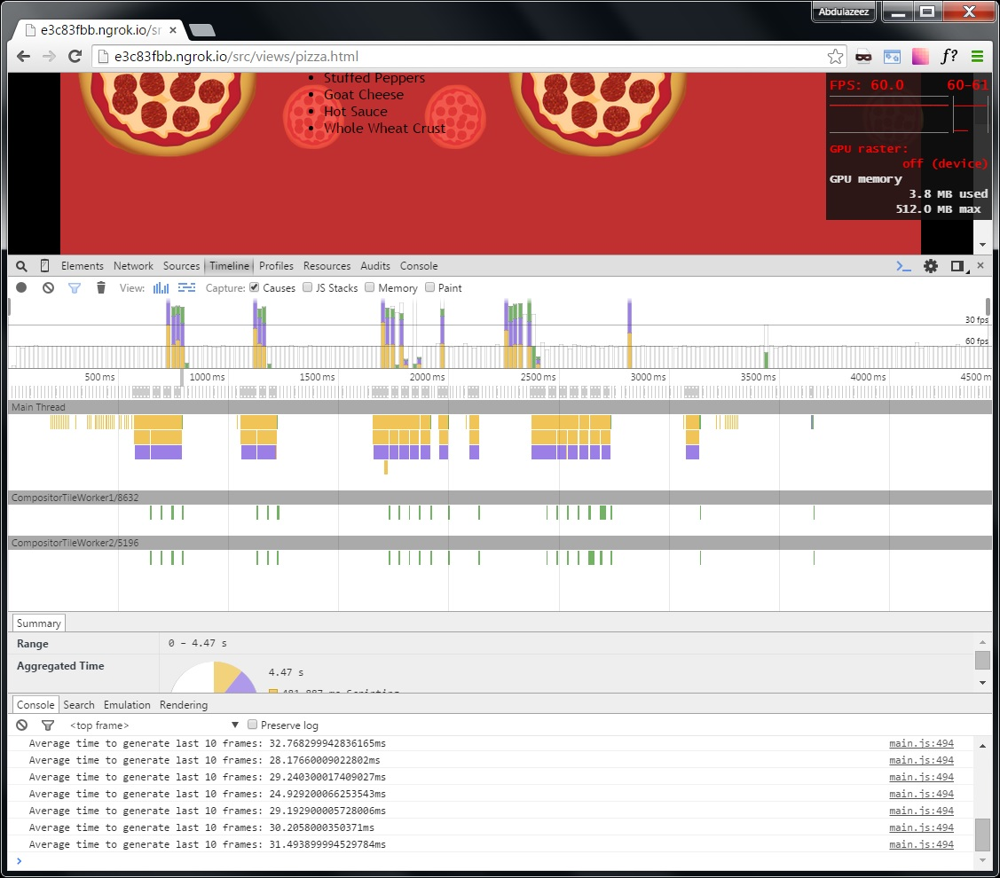
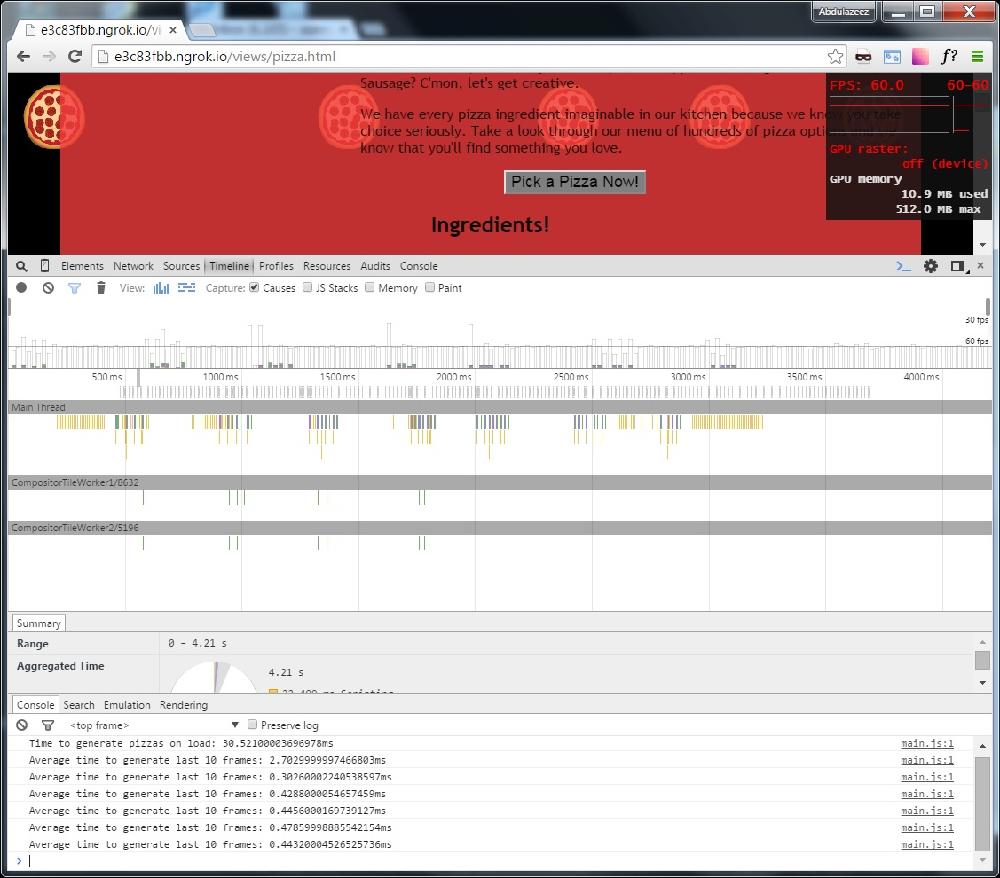

##Website Performance Optimization portfolio project

###I. Summary

####a. Move original project files to src folder located in project's main directory

src/							<br/>
&nbsp;&nbsp; index.html					<br/>
&nbsp;&nbsp; project-2048.html				<br/>
&nbsp;&nbsp; project-mobile.html			<br/>
&nbsp;&nbsp; project-webperf.html			<br/>
&nbsp;&nbsp; css/					<br/>
&nbsp;&nbsp;&nbsp;&nbsp; print.css			<br/>
&nbsp;&nbsp;&nbsp;&nbsp; style.css			<br/>
&nbsp;&nbsp; img/					<br/>
&nbsp;&nbsp;&nbsp;&nbsp; 2048.png			<br/>
&nbsp;&nbsp;&nbsp;&nbsp; cam&#95;be&#95;like.jpg	<br/>
&nbsp;&nbsp;&nbsp;&nbsp; mobilewebdev.jpg		<br/>
&nbsp;&nbsp;&nbsp;&nbsp; profilepic.jpg			<br/>
&nbsp;&nbsp; js/					<br/>
&nbsp;&nbsp;&nbsp;&nbsp; perfmatters.js			<br/>
&nbsp;&nbsp; views/					<br/>
&nbsp;&nbsp;&nbsp;&nbsp; pizza.html			<br/>
&nbsp;&nbsp;&nbsp;&nbsp; css/				<br/>
&nbsp;&nbsp;&nbsp;&nbsp;&nbsp;&nbsp; bootstrap-grid.css	<br/>
&nbsp;&nbsp;&nbsp;&nbsp;&nbsp;&nbsp; style.css		<br/>
&nbsp;&nbsp;&nbsp;&nbsp; images/			<br/>
&nbsp;&nbsp;&nbsp;&nbsp;&nbsp;&nbsp; pizza.png		<br/>
&nbsp;&nbsp;&nbsp;&nbsp;&nbsp;&nbsp; pizzeria.jpg	<br/>
&nbsp;&nbsp;&nbsp;&nbsp; js/				<br/>
&nbsp;&nbsp;&nbsp;&nbsp;&nbsp;&nbsp; main.js		<br/>

####b. Manually edit some project resources

- src/index.html: optimize CRP
- src/views/js/main.js: achieve 60 FPS on scroll and improve time to resize pizzas in src/views/pizza.html
- src/views/css/style.css: achieve 60 FPS on scroll in src/views/pizza.html

####c. Use gulp build system to produce project output in project's main folder

index.html					<br/>
project-2048.html				<br/>
project-mobile.html				<br/>
project-webperf.html				<br/>
css/						<br/>
&nbsp;&nbsp; print.css				<br/>
&nbsp;&nbsp; style.css				<br/>
img/						<br/>
&nbsp;&nbsp; 2048.png				<br/>
&nbsp;&nbsp; cam&#95;be&#95;like.jpg		<br/>
&nbsp;&nbsp; mobilewebdev.jpg			<br/>
&nbsp;&nbsp; profilepic.jpg			<br/>
js/						<br/>
&nbsp;&nbsp; perfmatters.js			<br/>
views/						<br/>
&nbsp;&nbsp; pizza.html				<br/>
&nbsp;&nbsp; css/				<br/>
&nbsp;&nbsp;&nbsp;&nbsp; bootstrap-grid.css	<br/>
&nbsp;&nbsp;&nbsp;&nbsp; style.css		<br/>
&nbsp;&nbsp; images/				<br/>
&nbsp;&nbsp;&nbsp;&nbsp; pizza.png		<br/>
&nbsp;&nbsp;&nbsp;&nbsp; pizzeria.jpg		<br/>
&nbsp;&nbsp; js/				<br/>
&nbsp;&nbsp;&nbsp;&nbsp; main.js		<br/>

###II. Part 1: Optimize PageSpeed Insights score for index.html

####a. Remove render-blocking JavaScript

- use async attribute with script tag for [http://www.google-analytics.com/analytics.js](http://www.google-analytics.com/analytics.js)

####b. Optimize CSS Delivery of the following

- remove CSS, [http://fonts.googleapis.com/css?family=Open+Sans:400,700](http://fonts.googleapis.com/css?family=Open+Sans:400,700) , from CRP by adding this stylesheet dynamically using JavaScript. So, this stylesheet is loaded after first render
- inline CSS, /css/style.css; this stylesheet is critical for the above the fold content; inlining this CSS eliminates a network round trip 
- use media="print" attribute on link tag for /css/print.css 

####c. Optimize Images 

- optimize images used on index.html page; see Part 3 below for details.

####d. Results - PageSpeed Insights score

- mobile: 95/100
- desktop: 96/100

###III. Part 2: Optimize Frames per Second in pizza.html

Edit src/views/js/main.js as described below:

####a. 60 FPS on scroll

- in DOMContentLoaded event handler, reduce number of moving pizzas from 200 to 50
- in DOMContentLoaded event handler, cache img element of moving pizzas in an array for later use in scroll event handler (updatePositions)
- in scroll event handler (updatePositions), cache results of document.body.scrollTop outside of the for-loop over .mover elements
- in src/views/css/style.css add style "will-change: transform;" to .mover selector to put .mover elements on their own layer

####b. Time to resize pizza less than 5 ms

- the determinDx function adds no value, therefore eliminate it; determine size of pizza with switch statement in changePizzaSizes function
- in the changePizzaSizes function, cache results of document.querySelectorAll(".randomPizzaContainer") outside of the for-loop
- in changePizzaSizes function, the for-loop is causing FSL, get desired pizza width outside of the for-loop, then batch 
style updates of pizza widths inside of the for-loop

####c. Results

- see below for before and after screenshots of timeline traces during scrolling on pizza.html
- pizza.html achieves 60 FPS after the improvements in step (a) were applied


**Figure 1: Timeline trace from chrome developer tools of pizza.html during scrolling BEFORE applying improvements from step (a)**


**Figure 2: Timeline trace from chrome developer tools of pizza.html during scrolling AFTER applying improvements from step (a)**

- time to resize pizzas was reduced from 158.75 ms to 1.23 ms after the improvements in step (b) were applied

###IV. Part 3: Automate Build with Gulp

####a. Setup

- clone the project [repository](https://github.com/otori23/fend-web-optimization "fend-web-optimization")
- install [nodejs](https://nodejs.org/ "nodejs")
- install [gulp](https://github.com/gulpjs/gulp/blob/master/docs/getting-started.md "Gulp")
- install [ImageMagick](http://www.imagemagick.org/script/binary-releases.php "ImageMagick"); the gulp plugins for image manipulation use ImageMagick
- run ``` bash$> npm install``` from the project's main folder; this gets all the node modules used by gulp
- build with ``` bash $> gulp --environment production``` from the project's main folder

####b. Build Actions

- resize src/views/images/pizzeria.jpg to closely match its display size (i.e. resize from 2048x1536 to 100x75)
- compress/optimize all images that are part of the project (including the resized src/views/images/pizzeria.jpg)
- minify HTML, CSS, JS resources

####c. Build Output

- the build output is placed in project's main folder (see part c in Summary section above).